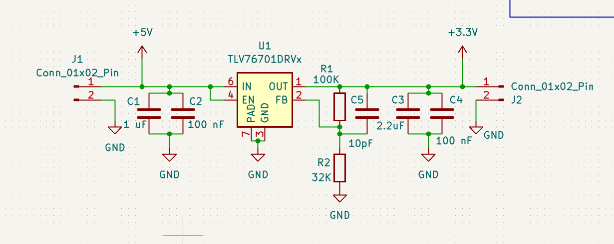
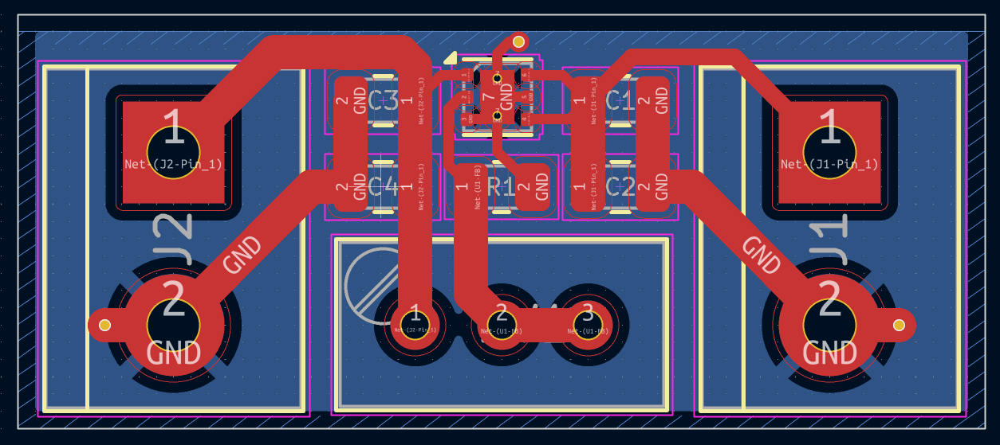
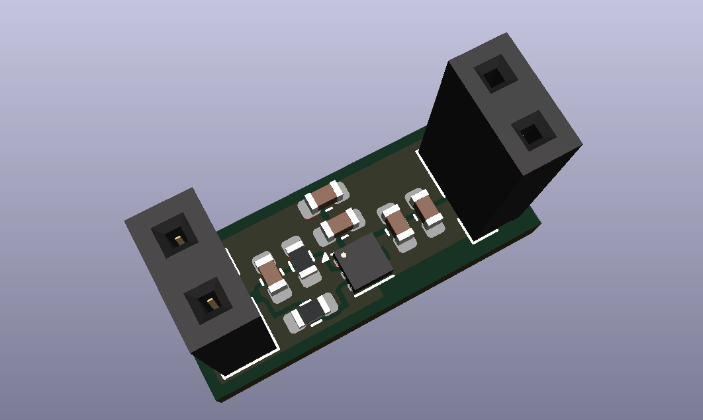

# TLV767 5 V-to-3.3 V LDO Power Supply PCB

## 1. Project Overview

A KiCad power-supply board designed to convert a **5 V DC input to a nominal 3.3 V output** using the adjustable **TLV76701DRVx** linear regulator with fixed feedback resistors.

The project covers datasheet-based component selection, feedback calculations, schematic capture, PCB layout, and electrical/design-rule checking.

**Status:** Schematic and PCB layout prepared; ERC and DRC reports are included. Simulation, fabrication, and bench testing are pending. Output current capability has not yet been established for this board.

This revision replaces the earlier potentiometer-adjustable design. Earlier files remain available in Git history.

### Schematic



### PCB Layout



### 3D View



## 2. Design Targets

| Parameter | Current design |
|---|---|
| Input voltage | 5 V DC |
| Nominal output voltage | 3.3 V, set by fixed resistors |
| Regulator | TLV76701DRVx |
| Package | DRV, 6-pin WSON, 2 mm × 2 mm, exposed pad |
| EDA tool | KiCad 9 |
| Routing | Tracks and copper zones on F.Cu |
| Bottom copper | No routed tracks or ground plane; through-hole pads include bottom copper |
| Output current | Target to be defined and checked against thermal limits |
| Hardware validation | Not fabricated or bench-tested |

The PCB file enables F.Cu and B.Cu; this is described as **top-layer routing**, rather than a confirmed single-copper-layer fabrication stackup.

## 3. Datasheet Information Used

The [TI TLV767 datasheet](https://www.ti.com/lit/ds/symlink/tlv767.pdf) provides the reference voltage, capacitor requirements, pinout, and layout guidance used for this design.

- Nominal feedback reference: **0.8 V**.
- The adjustable device uses an external resistor divider to set its output.
- EN may be connected to IN for always-on operation.
- Both GND pins must be grounded.
- Capacitor selection must account for effective capacitance, ESR, voltage rating, tolerance, and DC-bias effects.

The regulator's advertised current capability is a device rating, not a verified current rating for this PCB.

## 4. Pin Connection Summary

| Pin | Function | Connection |
|---|---|---|
| 1 | OUT | +3.3 V output |
| 2 | FB | R1/R2 divider junction |
| 3, 5 | GND | Ground |
| 4 | EN | +5 V input |
| 6 | IN | +5 V input |
| 7 | Exposed pad | Ground |

Input power enters through J1; J2 provides the output. PWR_FLAG symbols identify the externally supplied +5 V and ground nets for ERC.

## 5. Component Choices

| Reference | Value | Role |
|---|---|---|
| U1 | TLV76701DRVx | Adjustable linear regulator |
| R1 | 100 kΩ | Upper feedback resistor, OUT to FB |
| R2 | 32 kΩ | Lower feedback resistor, FB to GND |
| C1 | 1 µF | Input capacitance |
| C2 | 100 nF | Additional input bypass |
| C3 | 2.2 µF | Output capacitance |
| C4 | 100 nF | Additional output bypass |
| C5 | 10 pF | Feed-forward capacitor across R1 |
| J1, J2 | Two-pin connectors | Input and output connections |

C5 is included in this revision; its effect on transient behaviour has not yet been simulated or measured. Final capacitor part numbers, effective capacitance, and resistor tolerances remain to be documented.

## 6. Design Calculations

### Nominal output voltage

Using the nominal reference and resistor values:

```text
VOUT = VFB × (1 + R1/R2)
     = 0.8 × (1 + 100 kΩ / 32 kΩ)
     = 3.3 V
```

This is a calculated nominal value. Reference accuracy, resistor tolerances, and operating conditions affect the actual output.

### Regulator dissipation

Ignoring quiescent current for this first-order estimate:

```text
PD ≈ (VIN − VOUT) × IOUT
   ≈ 1.7 × IOUT
```

| Example load | Calculated regulator dissipation |
|---|---|
| 100 mA | 0.17 W |
| 250 mA | 0.425 W |
| 500 mA | 0.85 W |
| 1 A | 1.7 W |

These are illustrative calculations, not approved operating points. Board copper, ambient temperature, assembly, and package thermal behaviour must be considered before selecting a continuous-current rating.

## 7. PCB Layout Considerations

- Input capacitors are placed beside the regulator input.
- Output capacitors and the feedback network are placed near U1.
- Top-layer copper zones carry +5 V, +3.3 V, ground, and the feedback net.
- The U1 footprint includes two plated holes in its grounded exposed-pad area.
- There is no bottom ground plane; no measured heat-spreading benefit is claimed.
- U1 differs from the installed library footprint only in front-silkscreen graphics, as reviewed using KiCad's footprint comparison.

Manufacturing review should include the exposed-pad holes, solder-paste arrangement, and the selected board manufacturer's capabilities.

## 8. Verification and Limitations

Checks recorded on September 14, 2026:

| Check | Result |
|---|---|
| Schematic ERC | 0 errors, 0 warnings under configured checks |
| PCB DRC | 0 errors, 1 library-footprint warning |
| Unconnected pads | 0 |
| PCB–schematic parity | 0 issues in the parity-enabled DRC run |
| Footprint warning review | Front-silkscreen-only differences |
| Simulation | Pending |
| Fabrication / bench testing | Pending |

Reports: [ERC](docs/ERC-report.rpt) · [DRC](docs/DRC-report.rpt)

Four ERC check categories and five DRC check categories were ignored in the recorded configuration. These results do not represent all checks being enabled.

The ignored DRC categories were:
- Footprint has no courtyard defined.
- Footprint does not match the symbol's footprint filters.
- PTH inside courtyard.
- NPTH inside courtyard.
- Footprint component type does not match footprint pads.

The four ignored ERC categories still need to be recorded and reviewed. No manufacturer DFM approval, electrical performance, or thermal validation is claimed.

## 9. Repository Contents

| Path | Contents |
|---|---|
| [TLV767_LDO.kicad_pro](TLV767_LDO.kicad_pro) | KiCad project settings |
| [TLV767_LDO.kicad_sch](TLV767_LDO.kicad_sch) | Editable schematic |
| [TLV767_LDO.kicad_pcb](TLV767_LDO.kicad_pcb) | Editable PCB layout |
| [images/](images/) | Schematic, layout, and 3D views |
| [docs/](docs/) | ERC and DRC reports |

## 10. Next Steps

1. Define the intended load and continuous-current target.
2. Complete component-tolerance, thermal, and manufacturing review.
3. Review ignored rule checks and document their settings.
4. Simulate startup and load/input transients using TI's TLV76701 model.
5. Fabricate and perform bench tests when equipment and budget allow.

## References

- [TI TLV767 product page and simulation models](https://www.ti.com/product/TLV767)
- [TLV767 datasheet](https://www.ti.com/lit/ds/symlink/tlv767.pdf)
- [PSpice for TI](https://www.ti.com/tool/PSPICE-FOR-TI)
